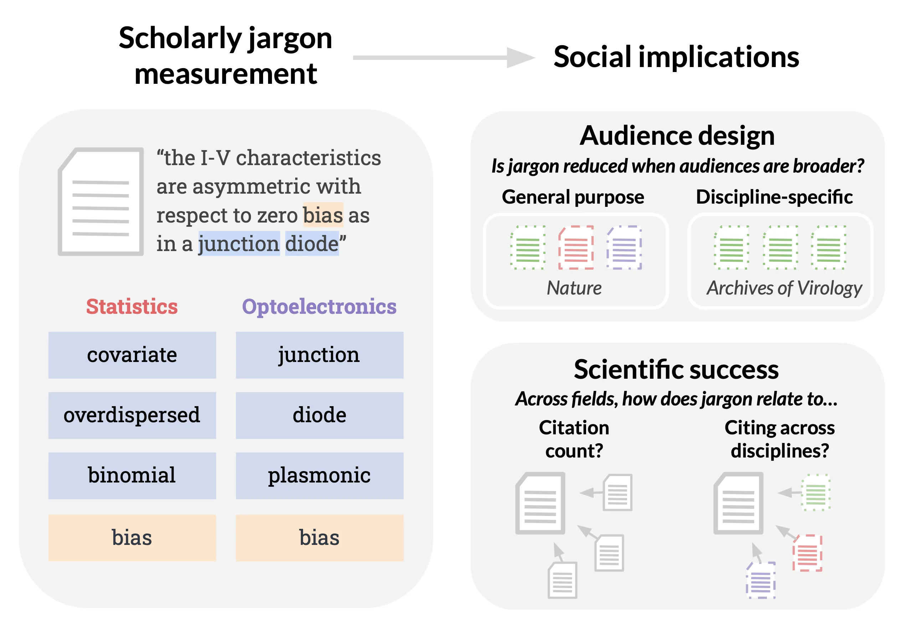

# Words as Gatekeepers

License: [CC BY-NC 4.0](https://creativecommons.org/licenses/by-nc/4.0/)

**Authors**: Li Lucy, Jesse Dodge, David Bamman, Katherine A. Keith

**[Paper](https://arxiv.org/abs/2212.09676)**, **[Blog post](https://blog.allenai.org/words-as-gatekeepers-measuring-discipline-specific-terms-and-meanings-in-scholarly-publications-718dc56d08a5)**

<p align="center">

</p>

**Abstract**: Scholarly text is often laden with jargon, or specialized language that can facilitate efficient in-group communication within fields but hinder understanding for out-groups. In this work, we develop and validate an interpretable approach for measuring scholarly jargon from text. Expanding the scope of prior work which focuses on word types, we use word sense induction to also identify words that are widespread but overloaded with different meanings across fields. We then estimate the prevalence of these discipline-specific words and senses across hundreds of subfields, and show that word senses provide a complementary, yet unique view of jargon alongside word types. We demonstrate the utility of our metrics for science of science and computational sociolinguistics by highlighting two key social implications. First, though most fields reduce their use of jargon when writing for general-purpose venues, and some fields (e.g., biological sciences) do so less than others. Second, the direction of correlation between jargon and citation rates varies among fields, but jargon is nearly always negatively correlated with interdisciplinary impact. Broadly, our findings suggest that though multidisciplinary venues intend to cater to more general audiences, some fields' writing norms may act as barriers rather than bridges, and thus impede the dispersion of scholarly ideas.

## Scholarly jargon

### Discipline-specific word senses

- `logs/word_clusters_lemmed/0.0/` includes senses and their top predicted substitutes. Use the `Word Cluster Analysis` notebook in the code folder to inspect the content of these files. 
- `logs/fos_senses/es-True_res-0.0/` includes senses and their npmi scores in each field

### Discipline-specific word types 

- `logs/type_npmi/fos_set-False_lemma-True/` includes lists of word types in each subfield and their npmi scores

## Code pipeline

**Data filtering**

Information on accessing S2ORC can be found [here](https://github.com/allenai/s2orc). 

- `data_process/clean_up_wikipedia.py`: sample a subset of Wikipedia 
- `create_mag_mapping()` in `val_data_process/fos_analysis.py`: get all MAG IDs to fos. 
- `langid.py` and `language_id_helper.py`: detect non-English journals for removal
- `data_preprocessing.py`: determine how many abstracts we have per journal, also outputs dataframe of paper IDs to journal and FOS to support dataset creation
- `General Dataset Statistics.ipynb`: examine the distribution of journal counts, save lists of paper IDs to keep for journal and FOS analysis. This generates `s2orc_fos.json`

The `paper_ids` that compose contemporary S2ORC can be found [here](https://drive.google.com/file/d/12JvkiuOhcvJJUSWqATBno4dA4vjJgfB5/view?usp=sharing). It is used by the `get_journal_venue` function in [this file](https://github.com/lucy3/words_as_gatekeepers/blob/main/code/type_jargon/helper.py) to filter for paper IDs to keep. 

A mapping from paper IDs to MAG fields of study can be found [here](https://drive.google.com/file/d/19ZGYPV31-CteYY8TNMq0yqBDpWburI3J/view?usp=sharing). 

**Word type pipeline**

In the `type_jargon` folder: 

FOS
- `word_counts_per_fos.py`: count words per field of study. 

Wikipedia
- `word_counts_wikipedia.py`: count words in simple and regular Wikipedia samples

Vocab to lemmatize
- `write_mask_preds/wsi_vocab.py`: vocab creation

Journals & FOS
- `word_type.py`: calculate NPMI

**WSI pipeline**

There are some additional supporting scripts, but these are the main ones to run. Note that many scripts are modified versions of ones found in the [WSIatScale repo](https://github.com/allenai/WSIatScale). 

Run `bash prepare_sense_input.sh 2>&1 | tee temp.log` to do the next three scripts: 

- `write_mask_preds/wsi_vocab.py`: determine vocabulary of words to perform WSI
- `val_data_process/process_wiktionary.py`: get wiktionary definitions for vocabulary words
- `write_mask_preds/wsi_preprocessing.py`: input preparation, also copy vocab file into output folder

Then, run the following script on S2ORC and Wikipedia: 

- `write_mask_preds/write_mask_preds.py`: write replacements 

We recommend splitting input files into numbered parts and running the script on ranges of file numbers. Usage example for S2ORC:

```
python write_mask_preds.py --data_dir /data/actual_data --out_dir /output --dataset s2orc --model scholarBERT --max_tokens_per_batch 16384 --write_specific_replacements --vocab_path /data/wsi_vocab_set_98_50.txt --overwrite_cache --files_range 0-24
```

Usage example for Wikipedia:

```
python write_mask_preds.py --data_dir /data/actual_data --out_dir /output --dataset wikipedia --model scholarBERT --max_tokens_per_batch 16384 --write_specific_replacements --vocab_path /data/wsi_vocab_set_98_50.txt --overwrite_cache --files_range 0-24
```

In the `WSIatScale` folder run `wsi_pipeline.sh` to do WSI pipeline for the entire vocab. You should change the file paths to redirect to yours, rather than the placeholders I included.  

- `create_inverted_index.py`: create inverted index

```
python create_inverted_index.py --replacements_dir /home/lucyl/language-map-of-science/logs/replacements/replacements --dataset s2orc --vocab_path /home/lucyl/language-map-of-science/logs/sense_vocab/wsi_vocab_set_98_50.txt --outdir /home/lucyl/language-map-of-science/logs/inverted_index --input_ids_path /home/lucyl/language-map-of-science/data/input_paper_ids/journal_analysis.txt
```

- `cluster_reps_per_token.py`: cluster the reps

Lemmatized, specifying resolution: 

```
python cluster_reps_per_token.py --data_dir /home/lucyl/language-map-of-science/logs/replacements/replacements --dataset s2orc --index_dir /home/lucyl/language-map-of-science/logs/inverted_index --out_dir /home/lucyl/language-map-of-science/logs/word_clusters_lemmed --lemmatize True --resolution 0.0
```

After clustering for the whole dataset, use `Wiktionary Validation.ipynb` notebook to get FOS to words json. Then use `wiktionary_eval.sh` to run wiktionary evaluation steps for clustering and assigning.

Cluster only wiktionary words, lemmatized, specifying resolution: 

```
python cluster_reps_per_token.py --data_dir /home/lucyl/language-map-of-science/logs/replacements/replacements --dataset s2orc --index_dir /home/lucyl/language-map-of-science/logs/inverted_index --out_dir /home/lucyl/language-map-of-science/logs/word_clusters_eval --lemmatize True --wiki_eval True --resolution 0.0
```

Can check the coverage of words that appear in FOS in `Wiktionary Validation.ipynb`. 

- `assign_clusters_to_tokens.py`: assign everyone to a cluster

Lemmatized, specifying resolution: 

```
python assign_clusters_to_tokens.py --out_dir /home/lucyl/language-map-of-science/logs/sense_assignments_lemmed --index_dir /home/lucyl/language-map-of-science/logs/inverted_index --dataset s2orc --data_dir /home/lucyl/language-map-of-science/logs/replacements/replacements --cluster_dir /home/lucyl/language-map-of-science/logs/word_clusters_lemmed --lemmatize True --resolution 0.0
```

Assign only wiktionary words, lemmatized, specifying resolution: 
```
python assign_clusters_to_tokens.py --out_dir /home/lucyl/language-map-of-science/logs/sense_assignments_eval --index_dir /home/lucyl/language-map-of-science/logs/inverted_index --dataset s2orc --data_dir /home/lucyl/language-map-of-science/logs/replacements/replacements --cluster_dir /home/lucyl/language-map-of-science/logs/word_clusters_eval --lemmatize True --wiki_eval True --resolution 0.5
```

Sense NPMI
- run `get_documentID_maps()` in `get_docID_to_group.py`
- `word_sense.py`, for journals, fos, and wiktionary evaluation
- `Wiktionary Validation.ipynb` is the notebook that contains Wiktionary evaluation results. 

**Social implication experiments**
- `Domain Language Analysis` is a notebook that generates data for some of the tables of example jargon in the paper. It also generates the figure that summarizes whether some fields tend to use more jargon than others, and whether a field tends to use lots of distinctive words, or repurpose existing words with distinctive meanings. 
- `get_discipline_specific.py`: get discipline specific journals and their papers, for the audience design experiment
- `jargonyness_per_paper.py`: calculate amount of jargon per abstract

Example usage: 
```
python jargonyness_per_paper.py --cutoff 0.1 --exp_name general_specific

python jargonyness_per_paper.py --cutoff 0.1 --exp_name regression_sample
```

- `expected_max_npmi.py`: expected max NPMI over token positions in abstract, for audience design experiment
- `Paper Jargon Rate.ipynb`: audience design plots
- `get_paper_time_and_place.py`: get FOS and year of potential papers that may cite the papers in regression study
- `General Dataset Statistics`: get data used for regression 
- `regression_variables.py`: get some of the simpler regression variables
- `citations_per_journal.py`: for calculating the average number of citations per journal, a regression variable
- `Paper Success Regression.ipynb`: notebook that runs regressions
- `get_fos_citation_matrix.py`: for calculating similarity among disciplines, part of interdisciplinarity regression

**Citation graph**

Future work may want to run analysis on the S2ORC citation graph. The below script supports the conversion of S2ORC data to a `graph-tool` network, where nodes are papers labeled with paper ID. 

- `citation_graph.py`: create citation graph 
